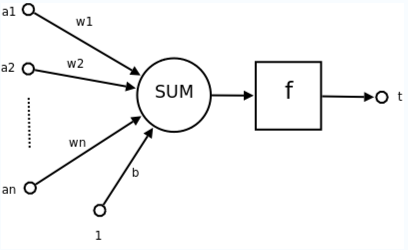
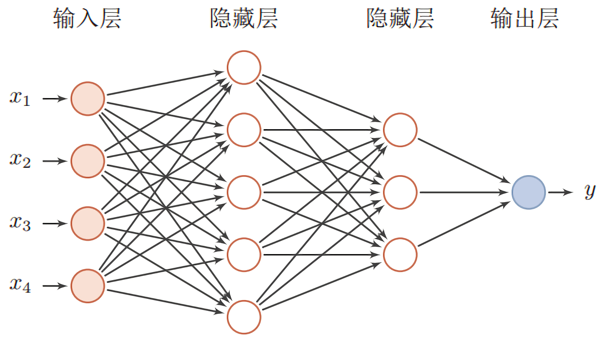
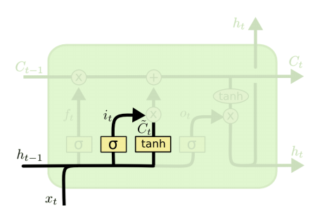
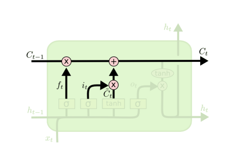
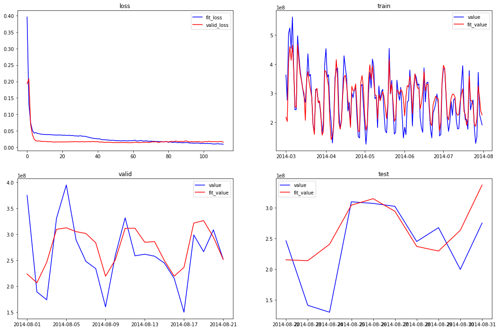

# 基于长短期记忆神经网络的余额宝资金流入流出预测及其Python实现

## 背景
余额宝拥有数以亿计的客户，且每天都涉及大量的资金流入和流出。在用户数量大、资金数额大等多重因素导致下，资金管理压力也非常大。既要保证资金的流动性，又要满足日常业务运转的情况。在此情况下，如何预测资金的流入流出情况变得尤为重要。

我们利用长短期记忆神经网络方法，分别对资金的流入和资金的流出进行预测。利用历史数据，尝试预测未来一个月的资金流入流出。

## 深度神经网络
### 神经元
神经网络是试图通过数学和计算机，来模拟生物中的神经网络。在生物中，神经网络由一个一个的神经元组成。


如图，是一个神经元，其中树突是接收信号的，树突所接收到的信号，会经过一系列的反应，最后会从轴突传递给下一个神经元。一系列的神经元，最终就组成了一个神经网络。

### 感知机
通过数学和计算机试图模拟神经元的方法，我们称之为感知机。



如图，是一个感知机。和神经元类似，接收很多参数，这些参数经过各种运算，最后把参数传给一个或几个感知机。

### 神经网络



如图是神经网络。
神经网络由三个部分组成：
1. 输入层
2. 隐藏层
3. 输出层

神经网络已的特点有：
1. 输入向量的维度和输入神经元的个数相同
2. 每个连接都有权值
3. 同一层神经元之间没有连接
4. 由输入层、隐藏层、输出层组成
5. 第N层与第N-1层的所有神经元连接，也称为全连接

在隐藏层足够多的时候，这个神经网络就被称为深度神经网络。

### 深度神经网络的缺点
深度神经网络从输入开始，经过复杂的结构，最终得到输出。对于图像识别等分类问题，深度神经网络有很好的应用。
但是，对于序列数据，比如自然语言、时间序列等。深度神经网络不能很好的进行处理。

## 循环神经网络
为了解决深度神经网络不能很好的处理序列的问题，引入循环神经网络。
### 循环神经网络的结构


如图所示，是循环神经网络的结构。
如输入所示，$X_1$、$X_t$、$X_t+1$是一系列的输入。而且每一个输出，都作为下一个神经元的输入。

### 和深度神经网络的比较


如图，左侧是深度神经网路，右侧是循环神经网络。

对于深度神经网络，每一个神经元的输出公式如下：
$$
h_t = sigmoid(W_x * X_t + b)
$$
即t时刻的输出，至于t时刻的输入有关。
> 其中$sigmoid$是激活函数，在实际中，激活函数有很多种，通常是$sigmoid$。

而在循环神经网络中，每一个神经元的输出公式如下：
$$
h_t = tanh(W_x * X_t + W_h * h_{t-1} + b)
$$
> 其中$tanh$是激活函数，在实际中，激活函数有很多种，通常是$tanh$。

**特别注意：循环神经网络也可以是深度神经网络。结构如下：**


### 循环神经网络的缺点
这样看起来，循环神经网络似乎非常满足序列化的数据。但是也有缺陷。
**1. 梯度消失与梯度爆炸**
由于RNN的在时间轴上展开，层数一般比较多。在RNN的梯度算法中，会出现权值$W$和激活函数的导数$f'$连乘的情况。

* 当$W$小于1时，$Wf'$中$f'$连乘会使梯度接近于0，出现梯度消失
* 当$W$大于1时，$Wf'$连乘会使梯度接近于$\infty$，出现梯度爆炸。

**2. 长距离依赖不足。**
**3. 难以进行训练。**

## 长短期记忆神经网络

为了克服循环神经网络的缺点，我们引入长短期记忆神经网络。

### 长短期记忆神经网络的结构


如图，是长短期记忆神经网络的结构。我们分几个部分讨论。

#### 遗忘门
长短期记忆神经网络需要选择性的忘记一些信息，这个通过遗忘门实现。
遗忘门：决定丢弃上一步的哪些信息。

其输出公式如下：
$$
f_t = \sigma(W_f \cdot [ h_{t-1},x_t ] + b_f)
$$
* `1`表示"完全保留"
* `0`表示"完全舍弃"
#### 输入门
同时，长短期记忆神经网络需要选择性的记住一些信息，这个通过输入门实现。
输入门：决定加入哪些新的信息。

其输出公式如下：
$$
i_t = \sigma(W_i \cdot [ h_{t-1},x_t ] + b_i)
$$
$$
\tilde{C_t} = tanh(W_c \cdot [ h_{t-1},x_t ] + b_C)
$$

#### 状态门
通过上面，我们得到了这些数值。
1. $f_t$用来控制是否忘记部分信息
2. $i_t$用来控制是否记住部分信息
3. $\tilde{C_t}$则是这一步的输出

此外，我们还有一个$C_{t-1}$，这是上一个神经元的状态。



其输出公式如下：
$$
C_t = f_t * C_{t-1} + i_t * \tilde{C_t}
$$
即，上一个神经元的状态$C_{t-1}$与$f_t$相乘，以忘记部分信息，再加上$i_t * \tilde{C_t}$，以记住部分信息。从而得到新的状态$C_t$，并传递给下一个神经元。

#### 输出门
最后一个输出门。


输出公式如下：
$$
o_t = \sigma(W_o[h_{t-1},x_t] + b_o)
$$
$$
h_t = o_t * tanh(C_t)
$$

####  特点
与其他神经网络相比，长短期记忆神经网络的特点是：
** 引入了状态的概念，从而可以选择性的遗忘或记住部分信息。**

### 长短期记忆神经网络的应用


常见的应用常见有四种

1、one to many
输入一个，输出序列化的多个。
比如："看图说话"，根据输入的图片，生成描述该图片的语句。

2、many to one
输入是序列化的多个，输出只有一个。
比如：视频分类。

3、many to many
输入是多个，输出也是之后序列的多个。
比如：时间序列，根据现在的输入，输出对未来的预测。

4、many to many
第四种输入是序列化的多个，输出也是序列化的多个。
比如：手写识别。输入是手写的一个句子，输出所识别的句子。

很明显，余额宝的资金流入流出预测是第三种。

## 单时间序列长短期记忆神经网络
**我们以资金流入为例，资金流出与这个类似。**
### 数据介绍

> 数据来自于阿里巴巴。地址如下：
> https://tianchi.aliyun.com/competition/entrance/231573/information

一共有四张表。分别是：用户信息表、用户申购赎回数据表、收益率表和上海银行间同业拆放利率（Shibor）表。
因为采用了单时间序列长短期记忆神经网络的方案，只用到了用户申购赎回数据表，这里只介绍用户申购数据表。

用户申购赎回数据表包含了 20130701 至 20140831 申购和赎回信息、以及所有的子类目信息， 数据经过脱敏处理。脱敏之后的数据，基本保持了原数据趋势。数据主要包括用户操作时间和操作记录，其中操作记录包括申购和赎回两个部分。金额的单位是分，即 0.01 元人民币。 如果用户今日消费总量为0，即consume_amt=0，则四个字类目为空。

| 列名 | 类型 | 含义 | 示例 |
| --- | --- | --- | --- |
| user_id | bigint | 用户 id | 1234 |
| report_date | string | 日期 |20140407 |
| tBalance | bigint | 今日余额 | 109004 |
| yBalance | bigint | 昨日余额 | 97389 |
| total_purchase_amt | bigint | 今日总购买量 = 直接购买 + 收益 | 21876 |
| direct_purchase_amt | bigint | 今日直接购买量 | 21863 |
| purchase_bal_amt | bigint | 今日支付宝余额购买量 | 0 |
| purchase_bank_amt | bigint | 今日银行卡购买量 | 21863 |
| total_redeem_amt | bigint | 今日总赎回量 = 消费 + 转出 | 10261 |
| consume_amt | bigint | 今日消费总量 | 0 |
| transfer_amt | bigint | 今日转出总量 | 10261 |
| tftobal_amt | bigint | 今日转出到支付宝余额总量 | 0 |
| tftocard_amt | bigint | 今日转出到银行卡总量 | 10261 |
| share_amt | bigint | 今日收益 | 13 |
| category1 | bigint | 今日类目 1 消费总额 | 0 |
| category2 | bigint | 今日类目 2 消费总额 | 0 |
| category3 | bigint | 今日类目 3 消费总额 | 0 |
| category4 | bigint | 今日类目 4 消费总额 | 0 |

注：
* 上述的数据都是经过脱敏处理的，收益为重新计算得到的，计算方法按照简化后的计算方式处理，具体计算方式在下节余额宝收益计算方式中描述。
* 脱敏后的数据保证了今日余额 = 昨日余额 + 今日申购 - 今日赎回，不会出现负值。

### Python实现
代码：
``` Python
import matplotlib.pyplot as plt
import pandas as pd
from sklearn.preprocessing import MinMaxScaler
import numpy as np

import tensorflow
tf = tensorflow.compat.v1
# 关闭动态图执行
tf.disable_eager_execution()

def generate_data():
    dateparse = lambda dates: pd.datetime.strptime(dates, '%Y%m%d')
    user_balance = pd.read_csv('user_balance_table.csv', parse_dates=['report_date'], date_parser=dateparse)

    user_balance = user_balance.groupby(['report_date'])['share_amt', 'total_purchase_amt'].sum()
    user_balance.reset_index(inplace=True)
    user_balance.index = user_balance['report_date']

    user_balance = user_balance['2014-03-01':'2014-08-31']

    data = {'total_purchase_amt': user_balance['total_purchase_amt']}

    df = pd.DataFrame(data=data, index=user_balance.index)
    df.to_csv(path_or_buf='single_purchase_seq.csv')


# 数据集归一化
def get_normal_data(purchase_seq):
    scaler = MinMaxScaler(feature_range=(0, 1))
    scaled_data = scaler.fit_transform(purchase_seq[['total_purchase_amt']])
    scaled_x_data = scaled_data[0: -1]
    scaled_y_data = scaled_data[1:]
    return scaled_x_data, scaled_y_data, scaler


# 构造训练集
def get_train_data(scaled_x_data, scaled_y_data, divide_train_valid_index, time_step):
    train_x, train_y = [], []
    normalized_train_feature = scaled_x_data[0: -divide_train_valid_index]
    normalized_train_label = scaled_y_data[0: -divide_train_valid_index]
    for i in range(len(normalized_train_feature) - time_step + 1):
        train_x.append(normalized_train_feature[i:i + time_step].tolist())
        train_y.append(normalized_train_label[i:i + time_step].tolist())
    return train_x, train_y


# 构造拟合训练集
def get_train_fit_data(scaled_x_data, scaled_y_data, divide_train_valid_index, time_step):
    train_fit_x, train_fit_y = [], []
    normalized_train_feature = scaled_x_data[0: -divide_train_valid_index]
    normalized_train_label = scaled_y_data[0: -divide_train_valid_index]
    train_fit_remain = len(normalized_train_label) % time_step
    train_fit_num = int((len(normalized_train_label) - train_fit_remain) / time_step)
    temp = []
    for i in range(train_fit_num):
        train_fit_x.append(normalized_train_feature[i * time_step:(i + 1) * time_step].tolist())
        temp.extend(normalized_train_label[i * time_step:(i + 1) * time_step].tolist())
    if train_fit_remain > 0:
        train_fit_x.append(normalized_train_feature[-time_step:].tolist())
        temp.extend(normalized_train_label[-train_fit_remain:].tolist())
    for i in temp:
        train_fit_y.append(i[0])
    return train_fit_x, train_fit_y, train_fit_remain


# 构造验证集
def get_valid_data(scaled_x_data, scaled_y_data, divide_train_valid_index, divide_valid_test_index, time_step):
    valid_x, valid_y = [], []
    normalized_valid_feature = scaled_x_data[-divide_train_valid_index: -divide_valid_test_index]
    normalized_valid_label = scaled_y_data[-divide_train_valid_index: -divide_valid_test_index]
    valid_remain = len(normalized_valid_label) % time_step
    valid_num = int((len(normalized_valid_label) - valid_remain) / time_step)
    temp = []
    for i in range(valid_num):
        valid_x.append(normalized_valid_feature[i * time_step:(i + 1) * time_step].tolist())
        temp.extend(normalized_valid_label[i * time_step:(i + 1) * time_step].tolist())
    if valid_remain > 0:
        valid_x.append(normalized_valid_feature[-time_step:].tolist())
        temp.extend(normalized_valid_label[-valid_remain:].tolist())
    for i in temp:
        valid_y.append(i[0])
    return valid_x, valid_y, valid_remain


# 构造测试集
def get_test_data(scaled_x_data, scaled_y_data, divide_valid_test_index, time_step):
    test_x, test_y = [], []
    normalized_test_feature = scaled_x_data[-divide_valid_test_index:]
    normalized_test_label = scaled_y_data[-divide_valid_test_index:]
    test_remain = len(normalized_test_label) % time_step
    test_num = int((len(normalized_test_label) - test_remain) / time_step)
    temp = []
    for i in range(test_num):
        test_x.append(normalized_test_feature[i * time_step:(i + 1) * time_step].tolist())
        temp.extend(normalized_test_label[i * time_step:(i + 1) * time_step].tolist())
    if test_remain > 0:
        test_x.append(scaled_x_data[-time_step:].tolist())
        temp.extend(normalized_test_label[-test_remain:].tolist())
    for i in temp:
        test_y.append(i[0])
    return test_x, test_y, test_remain

generate_data()


# 模型参数
lr = 1e-3  # 学习率
batch_size = 10  # minibatch 大小
rnn_unit = 30  # LSTM 隐藏层神经元数量
input_size = 1  # 单元的输入数量
output_size = 1  # 单元的输出数量
time_step = 15  # 时间长度
epochs = 1000  # 训练次数
gradient_threshold = 15  # 梯度裁剪阈值
stop_loss = np.float32(0.045)  # 训练停止条件。当训练误差 + 验证误差小于阈值时，停止训练
train_keep_prob = [1.0, 0.5, 1.0]  # 训练时 dropout 神经元保留比率

# 数据切分参数
divide_train_valid_index = 30
divide_valid_test_index = 10

# 数据准备
dateparse = lambda dates: pd.datetime.strptime(dates, '%Y-%m-%d')
single_purchase_seq = pd.read_csv('single_purchase_seq.csv', parse_dates=['report_date'], index_col='report_date', date_parser=dateparse)

scaled_x_data, scaled_y_data, scaler = get_normal_data(single_purchase_seq)
train_x, train_y = get_train_data(scaled_x_data, scaled_y_data, divide_train_valid_index, time_step)
train_fit_x, train_fit_y, train_fit_remain = get_train_fit_data(scaled_x_data, scaled_y_data, divide_train_valid_index, time_step)
valid_x, valid_y, valid_remain = get_valid_data(scaled_x_data, scaled_y_data, divide_train_valid_index, divide_valid_test_index, time_step)
test_x, test_y, test_remain = get_test_data(scaled_x_data, scaled_y_data, divide_valid_test_index, time_step)


def lstm(X, keep_prob):
    batch_size = tf.shape(X)[0]  # minibatch 大小

    # 输入到 LSTM 输入的转换，一层全连接的网络，其中权重初始化采用截断的高斯分布，激活函数采用tanh
    weights = tf.Variable(tf.truncated_normal(shape=[input_size, rnn_unit]))
    biases = tf.Variable(tf.constant(0.1, shape=[rnn_unit, ]))
    input = tf.reshape(X, [-1, input_size])

    tanh_layer = tf.nn.tanh(tf.matmul(input, weights) + biases)
    input_rnn = tf.nn.dropout(tanh_layer, keep_prob[0])
    input_rnn = tf.reshape(input_rnn, [-1, time_step, rnn_unit])

    # 两层 LSTM 网络，激活函数默认采用 tanh，当网络层数较深时，建议使用 relu
    initializer = tf.truncated_normal_initializer()
    cell_1 = tf.nn.rnn_cell.LSTMCell(forget_bias=1.0, num_units=rnn_unit, use_peepholes=True, num_proj=None, initializer=initializer, name='lstm_cell_1')
    cell_1_drop = tf.nn.rnn_cell.DropoutWrapper(cell=cell_1, output_keep_prob=keep_prob[1])

    cell_2 = tf.nn.rnn_cell.LSTMCell(forget_bias=1.0, num_units=rnn_unit, use_peepholes=True, num_proj=output_size, initializer=initializer, name='lstm_cell_2')
    cell_2_drop = tf.nn.rnn_cell.DropoutWrapper(cell=cell_2, output_keep_prob=keep_prob[2])

    mutilstm_cell = tf.nn.rnn_cell.MultiRNNCell(cells=[cell_1_drop, cell_2_drop], state_is_tuple=True)
    init_state = mutilstm_cell.zero_state(batch_size, dtype=tf.float32)

    with tf.variable_scope('lstm', reuse=tf.AUTO_REUSE):
        output, state = tf.nn.dynamic_rnn(cell=mutilstm_cell, inputs=input_rnn, initial_state=init_state, dtype=tf.float32)

    return output, state

# 获取拟合数据，这里用于拟合，关闭 dropout
def get_fit_seq(x, remain, sess, output, X, keep_prob, scaler, inverse):
    fit_seq = []
    if inverse:
        # 前面对数据进行了归一化，这里反归一化还原数据
        temp = []
        for i in range(len(x)):
            next_seq = sess.run(output, feed_dict={X: [x[i]], keep_prob: [1.0, 1.0, 1.0]})
            if i == len(x) - 1:
                temp.extend(scaler.inverse_transform(next_seq[0].reshape(-1, 1))[-remain:])
            else:
                temp.extend(scaler.inverse_transform(next_seq[0].reshape(-1, 1)))
        for i in temp:
            fit_seq.append(i[0])
    else:
        for i in range(len(x)):
            next_seq = sess.run(output,
                                feed_dict={X: [x[i]], keep_prob: [1.0, 1.0, 1.0]})
            if i == len(x) - 1:
                fit_seq.extend(next_seq[0].reshape(1, -1).tolist()[0][-remain:])
            else:
                fit_seq.extend(next_seq[0].reshape(1, -1).tolist()[0])

    return fit_seq


def train_lstm():
    X = tf.placeholder(tf.float32, [None, time_step, input_size])
    Y = tf.placeholder(tf.float32, [None, time_step, output_size])

    keep_prob = tf.placeholder(tf.float32, [None])
    output, state = lstm(X, keep_prob)
    loss = tf.losses.mean_squared_error(tf.reshape(output, [-1]), tf.reshape(Y, [-1]))

    # 梯度优化与裁剪
    optimizer = tf.train.AdamOptimizer(learning_rate=lr)
    grads, variables = zip(*optimizer.compute_gradients(loss))
    grads, global_norm = tf.clip_by_global_norm(grads, gradient_threshold)
    train_op = optimizer.apply_gradients(zip(grads, variables))

    X_train_fit = tf.placeholder(tf.float32, [None])
    Y_train_fit = tf.placeholder(tf.float32, [None])
    train_fit_loss = tf.losses.mean_squared_error(tf.reshape(X_train_fit, [-1]), tf.reshape(Y_train_fit, [-1]))

    X_valid = tf.placeholder(tf.float32, [None])
    Y_valid = tf.placeholder(tf.float32, [None])
    valid_fit_loss = tf.losses.mean_squared_error(tf.reshape(X_valid, [-1]), tf.reshape(Y_valid, [-1]))

    with tf.Session() as sess:
        sess.run(tf.global_variables_initializer())
        fit_loss_seq = []
        valid_loss_seq = []

        for epoch in range(epochs):
            for index in range(len(train_x) - batch_size + 1):
               sess.run(train_op, feed_dict={X: train_x[index: index + batch_size], Y: train_y[index: index + batch_size], keep_prob: train_keep_prob})

            # 拟合训练集和验证集
            train_fit_seq = get_fit_seq(train_fit_x, train_fit_remain, sess, output, X, keep_prob, scaler, False)
            train_loss = sess.run(train_fit_loss, {X_train_fit: train_fit_seq, Y_train_fit: train_fit_y})
            fit_loss_seq.append(train_loss)

            valid_seq = get_fit_seq(valid_x, valid_remain, sess, output, X, keep_prob, scaler, False)
            valid_loss = sess.run(valid_fit_loss, {X_valid: valid_seq, Y_valid: valid_y})
            valid_loss_seq.append(valid_loss)

            print('epoch:', epoch + 1, 'fit loss:', train_loss, 'valid loss:', valid_loss)

            # 提前终止条件。
            # 常见的方法是验证集达到最小值，再往后训练 n 步，loss 不再减小，实际测试这里使用的效果不好。
            # 这里选择 stop_loss 是经过多次尝试得到的阈值。
            if train_loss + valid_loss <= stop_loss:
                train_fit_seq = get_fit_seq(train_fit_x, train_fit_remain, sess, output, X, keep_prob, scaler, True)
                valid_fit_seq = get_fit_seq(valid_x, valid_remain, sess, output, X, keep_prob, scaler, True)
                test_fit_seq = get_fit_seq(test_x, test_remain, sess, output, X, keep_prob, scaler, True)
                print('best epoch: ', epoch + 1)
                break


    return fit_loss_seq, valid_loss_seq, train_fit_seq, valid_fit_seq, test_fit_seq


fit_loss_seq, valid_loss_seq, train_fit_seq, valid_fit_seq, test_fit_seq = train_lstm()

# 切分训练集、测试集
purchase_seq_train = single_purchase_seq[1:-divide_train_valid_index]
purchase_seq_valid = single_purchase_seq[-divide_train_valid_index:-divide_valid_test_index]
purchase_seq_test = single_purchase_seq[-divide_valid_test_index:]

plt.figure(figsize=(18, 12))

plt.subplot(221)
plt.title('loss')
plt.plot(fit_loss_seq, label='fit_loss', color='blue')
plt.plot(valid_loss_seq, label='valid_loss', color='red')
plt.legend(loc='best')

plt.subplot(222)
plt.title('train')
seq_train_fit = pd.DataFrame(columns=['total_purchase_amt'], data=train_fit_seq, index=purchase_seq_train.index)
plt.plot(purchase_seq_train['total_purchase_amt'], label='value', color='blue')
plt.plot(seq_train_fit['total_purchase_amt'], label='fit_value', color='red')
plt.legend(loc='best')

plt.subplot(223)
plt.title('valid')
seq_valid_fit = pd.DataFrame(columns=['total_purchase_amt'], data=valid_fit_seq, index=purchase_seq_valid.index)
plt.plot(purchase_seq_valid['total_purchase_amt'], label='value', color='blue')
plt.plot(seq_valid_fit['total_purchase_amt'], label='fit_value', color='red')
plt.legend(loc='best')

plt.subplot(224)
plt.title('test')
seq_test_fit = pd.DataFrame(columns=['total_purchase_amt'], data=test_fit_seq, index=purchase_seq_test.index)
plt.plot(purchase_seq_test['total_purchase_amt'], label='value', color='blue')
plt.plot(seq_test_fit['total_purchase_amt'], label='fit_value', color='red')
plt.legend(loc='best')

plt.show()
```
运行：
``` Code
epoch: 1 fit loss: 0.2170721 valid loss: 0.055167664
epoch: 2 fit loss: 0.12749547 valid loss: 0.04400786
epoch: 3 fit loss: 0.0764646 valid loss: 0.031636328

【部分运行结果略】

epoch: 71 fit loss: 0.026300926 valid loss: 0.01985839
epoch: 72 fit loss: 0.025777007 valid loss: 0.0194228
epoch: 73 fit loss: 0.025176931 valid loss: 0.019551642
best epoch:  73
```


## 多时间序列长短期记忆神经网络
**我们以资金流入为例，资金流出与这个类似。**

在上一步中，我们的是根据历史的资金流入流出预测未来的资金流入流出，只有一个参数。
现在，我们选取多个参数。

1. share_amt：余额宝今日收益
2. mfd_daily_yield：余额宝万份收益
3. mfd_7daily_yield：余额宝七日年化收益率
4. Interest_O_N：银行隔夜利率
5. Interest_1_W：银行1周利率
6. Interest_1_M：银行1个月利率

### 数据介绍

> 数据同样来自于阿里巴巴。地址如下：
> https://tianchi.aliyun.com/competition/entrance/231573/information

一共有四张表。分别是：用户信息表、用户申购赎回数据表、收益率表和上海银行间同业拆放利率（Shibor）表。
我们这次用到的表有
1. 用户申购赎回数据表
2. 收益率表
3. 上海银行间同业拆放利率（Shibor）表

收益表为余额宝在14个月内的收益率表：mfd_day_share_interest。

| 列名             | 类型   | 含义                          | 示例                  |
| ---------------- | ------ | ----------------------------- | --------------------- |
| mfd_date         | string | 日期                          | 20140102 |
| mfd_daily_yield  | double | 万份收益，即 1 万块钱的收益。 | 1.5787 |
| mfd_7daily_yield | double |  七日年化收益率（ % ） | 6.307 |

银行间拆借利率表是 14 个月期间银行之间的拆借利率（皆为年化利率）： mfd_bank_shibor 。

| 列名         | 类型   | 含义           | 示例     |
| ------------ | ------ | -------------- | -------- |
| mfd_date     | String | 日期           | 20140102 |
| Interest_O_N | Double | 隔夜利率（%）  | 2.8      |
| Interest_1_W | Double | 1周利率（%）   | 4.25     |
| Interest_2_W | Double | 2周利率（%）   | 4.9      |
| Interest_1_M | Double | 1个月利率（%） | 5.04     |
| Interest_3_M | Double | 3个月利率（%） | 4.91     |
| Interest_6_M | Double | 6个月利率（%） | 4.79     |
| Interest_9_M | Double | 9个月利率（%） | 4.76     |
| Interest_1_Y | Double | 1年利率（%）   | 4.78     |

### Python实现
代码：
``` Python
import matplotlib.pyplot as plt
import pandas as pd
from sklearn.preprocessing import MinMaxScaler
import numpy as np

import tensorflow
tf = tensorflow.compat.v1
# 关闭动态图执行
tf.disable_eager_execution()

tf.reset_default_graph()

def generate_data():
    dateparse = lambda dates: pd.datetime.strptime(dates, '%Y%m%d')
    user_balance = pd.read_csv('user_balance_table.csv', parse_dates=['report_date'],
                               date_parser=dateparse)

    mfd_day_share_interest = pd.read_csv('mfd_day_share_interest.csv', parse_dates=['mfd_date'],
                                         date_parser=dateparse)
    mfd_day_share_interest.index = mfd_day_share_interest['mfd_date']

    mfd_bank_shibor = pd.read_csv('mfd_bank_shibor.csv', parse_dates=['mfd_date'], date_parser=dateparse)
    mfd_bank_shibor.index = mfd_bank_shibor['mfd_date']

    user_balance = user_balance.groupby(['report_date'])['share_amt', 'total_purchase_amt'].sum()
    user_balance.reset_index(inplace=True)
    user_balance.index = user_balance['report_date']

    user_balance = user_balance['2014-03-01':'2014-08-31']
    mfd_day_share_interest = mfd_day_share_interest['2014-03-01':'2014-08-31']
    mfd_bank_shibor = mfd_bank_shibor['2014-03-01':'2014-08-31']

    data = {'share_amt': user_balance['share_amt'],
            'total_purchase_amt': user_balance['total_purchase_amt'],
            'mfd_daily_yield': mfd_day_share_interest['mfd_daily_yield'],
            'mfd_7daily_yield': mfd_day_share_interest['mfd_7daily_yield'],
            'Interest_O_N': mfd_bank_shibor['Interest_O_N'],
            'Interest_1_W': mfd_bank_shibor['Interest_1_W'],
            'Interest_1_M': mfd_bank_shibor['Interest_1_M']}

    df = pd.DataFrame(data=data, index=user_balance.index)

    df['Interest_O_N'].fillna(df['Interest_O_N'].median(), inplace=True)
    df['Interest_1_W'].fillna(df['Interest_1_W'].median(), inplace=True)
    df['Interest_1_M'].fillna(df['Interest_1_M'].median(), inplace=True)

    df.to_csv(path_or_buf='multi_purchase_seq.csv')


# 数据集归一化
def get_normal_data(purchase_seq):
    scaler_x = MinMaxScaler(feature_range=(0, 1))
    scaler_y = MinMaxScaler(feature_range=(0, 1))
    scaled_x_data = scaler_x.fit_transform(purchase_seq[ ['Interest_1_M', 'Interest_1_W', 'Interest_O_N', 'mfd_7daily_yield', 'mfd_daily_yield', 'share_amt']])
    scaled_y_data = scaler_y.fit_transform(purchase_seq[['total_purchase_amt']])
    return scaled_x_data, scaled_y_data, scaler_y


# 构造训练集
def get_train_data(scaled_x_data, scaled_y_data, divide_train_valid_index, time_step):
    train_x, train_y = [], []
    normalized_train_feature = scaled_x_data[0: -divide_train_valid_index]
    normalized_train_label = scaled_y_data[0: -divide_train_valid_index]
    for i in range(len(normalized_train_feature) - time_step + 1):
        train_x.append(normalized_train_feature[i:i + time_step].tolist())
        train_y.append(normalized_train_label[i:i + time_step].tolist())
    return train_x, train_y


# 构造拟合训练集
def get_train_fit_data(scaled_x_data, scaled_y_data, divide_train_valid_index, time_step):
    train_fit_x, train_fit_y = [], []
    normalized_train_feature = scaled_x_data[0: -divide_train_valid_index]
    normalized_train_label = scaled_y_data[0: -divide_train_valid_index]
    train_fit_remain = len(normalized_train_label) % time_step
    train_fit_num = int((len(normalized_train_label) - train_fit_remain) / time_step)
    temp = []
    for i in range(train_fit_num):
        train_fit_x.append(normalized_train_feature[i * time_step:(i + 1) * time_step].tolist())
        temp.extend(normalized_train_label[i * time_step:(i + 1) * time_step].tolist())
    if train_fit_remain > 0:
        train_fit_x.append(normalized_train_feature[-time_step:].tolist())
        temp.extend(normalized_train_label[-train_fit_remain:].tolist())
    for i in temp:
        train_fit_y.append(i[0])
    return train_fit_x, train_fit_y, train_fit_remain


# 构造验证集
def get_valid_data(scaled_x_data, scaled_y_data, divide_train_valid_index, divide_valid_test_index, time_step):
    valid_x, valid_y = [], []
    normalized_valid_feature = scaled_x_data[-divide_train_valid_index: -divide_valid_test_index]
    normalized_valid_label = scaled_y_data[-divide_train_valid_index: -divide_valid_test_index]
    valid_remain = len(normalized_valid_label) % time_step
    valid_num = int((len(normalized_valid_label) - valid_remain) / time_step)
    temp = []
    for i in range(valid_num):
        valid_x.append(normalized_valid_feature[i * time_step:(i + 1) * time_step].tolist())
        temp.extend(normalized_valid_label[i * time_step:(i + 1) * time_step].tolist())
    if valid_remain > 0:
        valid_x.append(normalized_valid_feature[-time_step:].tolist())
        temp.extend(normalized_valid_label[-valid_remain:].tolist())
    for i in temp:
        valid_y.append(i[0])
    return valid_x, valid_y, valid_remain


# 构造测试集
def get_test_data(scaled_x_data, scaled_y_data, divide_valid_test_index, time_step):
    test_x, test_y = [], []
    normalized_test_feature = scaled_x_data[-divide_valid_test_index:]
    normalized_test_label = scaled_y_data[-divide_valid_test_index:]
    test_remain = len(normalized_test_label) % time_step
    test_num = int((len(normalized_test_label) - test_remain) / time_step)
    temp = []
    for i in range(test_num):
        test_x.append(normalized_test_feature[i * time_step:(i + 1) * time_step].tolist())
        temp.extend(normalized_test_label[i * time_step:(i + 1) * time_step].tolist())
    if test_remain > 0:
        test_x.append(scaled_x_data[-time_step:].tolist())
        temp.extend(normalized_test_label[-test_remain:].tolist())
    for i in temp:
        test_y.append(i[0])
    return test_x, test_y, test_remain

generate_data()

# 模型参数
lr = 1e-3  # 学习率
batch_size = 10  # minibatch大小
rnn_unit = 40  # LSTM 隐藏层神经元数量
input_size = 6  # 单元的输入数量
output_size = 1  # 单元的输出数量
time_step = 15  # 时间长度
epochs = 1000  # 训练次数
gradient_threshold = 5  # 梯度裁剪阈值
stop_loss = np.float32(0.025)  # 训练停止条件。当训练误差 + 验证误差小于阈值时，停止训练
train_keep_prob = [1.0, 0.5, 1.0]  # 训练时 dropout 神经元保留比率

# 数据切分参数
divide_train_valid_index = 31
divide_valid_test_index = 10

# 数据准备
dateparse = lambda dates: pd.datetime.strptime(dates, '%Y-%m-%d')
purchase_seq = pd.read_csv('multi_purchase_seq.csv', parse_dates=['report_date'], index_col='report_date', date_parser=dateparse)

scaled_x_data, scaled_y_data, scaler_y = get_normal_data(purchase_seq)
train_x, train_y = get_train_data(scaled_x_data, scaled_y_data, divide_train_valid_index, time_step)
train_fit_x, train_fit_y, train_fit_remain = get_train_fit_data(scaled_x_data, scaled_y_data, divide_train_valid_index, time_step)
valid_x, valid_y, valid_remain = get_valid_data(scaled_x_data, scaled_y_data, divide_train_valid_index, divide_valid_test_index, time_step)
test_x, test_y, test_remain = get_test_data(scaled_x_data, scaled_y_data, divide_valid_test_index, time_step)


def lstm(X, keep_prob):
    batch_size = tf.shape(X)[0]  # minibatch 大小

    # 输入到 LSTM 输入的转换，一层全连接的网络，其中权重初始化采用截断的高斯分布，激活函数采用tanh
    weights = tf.Variable(tf.truncated_normal(shape=[input_size, rnn_unit]))
    biases = tf.Variable(tf.constant(0.1, shape=[rnn_unit, ]))
    input = tf.reshape(X, [-1, input_size])

    input_layer = tf.nn.tanh(tf.matmul(input, weights) + biases)
    input_rnn = tf.nn.dropout(input_layer, keep_prob[0])
    input_rnn = tf.reshape(input_rnn, [-1, time_step, rnn_unit])

    # 两层 LSTM 网络，激活函数默认采用 tanh，当网络层数较深时，建议使用 relu
    initializer = tf.truncated_normal_initializer()
    cell_1 = tf.nn.rnn_cell.LSTMCell(forget_bias=1.0, num_units=rnn_unit, use_peepholes=True, num_proj=None, initializer=initializer, name='lstm_cell_1')
    cell_1_drop = tf.nn.rnn_cell.DropoutWrapper(cell=cell_1, output_keep_prob=keep_prob[1])

    cell_2 = tf.nn.rnn_cell.LSTMCell(forget_bias=1.0, num_units=rnn_unit, use_peepholes=True, num_proj=output_size, initializer=initializer, name='lstm_cell_2')
    cell_2_drop = tf.nn.rnn_cell.DropoutWrapper(cell=cell_2, output_keep_prob=keep_prob[2])

    mutilstm_cell = tf.nn.rnn_cell.MultiRNNCell(cells=[cell_1_drop, cell_2_drop], state_is_tuple=True)
    init_state = mutilstm_cell.zero_state(batch_size, dtype=tf.float32)

    with tf.variable_scope('lstm', reuse=tf.AUTO_REUSE):
        output, state = tf.nn.dynamic_rnn(cell=mutilstm_cell, inputs=input_rnn, initial_state=init_state, dtype=tf.float32)

    return output, state

# 获取拟合数据，这里用于拟合，关闭 dropout
def get_fit_seq(x, remain, sess, output, X, keep_prob, scaler, inverse):
    fit_seq = []
    if inverse:
        # 前面对数据进行了归一化，这里反归一化还原数据
        temp = []
        for i in range(len(x)):
            next_seq = sess.run(output, feed_dict={X: [x[i]], keep_prob: [1.0, 1.0, 1.0]})
            if i == len(x) - 1:
                temp.extend(scaler.inverse_transform(next_seq[0].reshape(-1, 1))[-remain:])
            else:
                temp.extend(scaler.inverse_transform(next_seq[0].reshape(-1, 1)))
        for i in temp:
            fit_seq.append(i[0])
    else:
        for i in range(len(x)):
            next_seq = sess.run(output,
                                feed_dict={X: [x[i]], keep_prob: [1.0, 1.0, 1.0]})
            if i == len(x) - 1:
                fit_seq.extend(next_seq[0].reshape(1, -1).tolist()[0][-remain:])
            else:
                fit_seq.extend(next_seq[0].reshape(1, -1).tolist()[0])

    return fit_seq


def train_lstm():
    X = tf.placeholder(tf.float32, [None, time_step, input_size])
    Y = tf.placeholder(tf.float32, [None, time_step, output_size])

    keep_prob = tf.placeholder(tf.float32, [None])
    output, state = lstm(X, keep_prob)
    loss = tf.losses.mean_squared_error(tf.reshape(output, [-1]), tf.reshape(Y, [-1]))

    # 梯度优化与裁剪
    optimizer = tf.train.AdamOptimizer(learning_rate=lr)
    grads, variables = zip(*optimizer.compute_gradients(loss))
    grads, global_norm = tf.clip_by_global_norm(grads, gradient_threshold)
    train_op = optimizer.apply_gradients(zip(grads, variables))

    X_train_fit = tf.placeholder(tf.float32, [None])
    Y_train_fit = tf.placeholder(tf.float32, [None])
    train_fit_loss = tf.losses.mean_squared_error(tf.reshape(X_train_fit, [-1]), tf.reshape(Y_train_fit, [-1]))

    X_valid = tf.placeholder(tf.float32, [None])
    Y_valid = tf.placeholder(tf.float32, [None])
    valid_fit_loss = tf.losses.mean_squared_error(tf.reshape(X_valid, [-1]), tf.reshape(Y_valid, [-1]))

    with tf.Session() as sess:
        sess.run(tf.global_variables_initializer())
        fit_loss_seq = []
        valid_loss_seq = []

        for epoch in range(epochs):
            for index in range(len(train_x) - batch_size + 1):
               sess.run(train_op, feed_dict={X: train_x[index: index + batch_size], Y: train_y[index: index + batch_size], keep_prob: train_keep_prob})

            # 拟合训练集和验证集
            train_fit_seq = get_fit_seq(train_fit_x, train_fit_remain, sess, output, X, keep_prob, scaler_y, False)
            train_loss = sess.run(train_fit_loss, {X_train_fit: train_fit_seq, Y_train_fit: train_fit_y})
            fit_loss_seq.append(train_loss)

            valid_seq = get_fit_seq(valid_x, valid_remain, sess, output, X, keep_prob, scaler_y, False)
            valid_loss = sess.run(valid_fit_loss, {X_valid: valid_seq, Y_valid: valid_y})
            valid_loss_seq.append(valid_loss)

            print('epoch:', epoch + 1, 'fit loss:', train_loss, 'valid loss:', valid_loss)

            # 提前终止条件。
            # 常见的方法是验证集达到最小值，再往后训练 n 步，loss 不再减小，实际测试这里使用的效果不好。
            # 这里选择 stop_loss 是经过多次尝试得到的阈值。
            if train_loss + valid_loss <= stop_loss:
                train_fit_seq = get_fit_seq(train_fit_x, train_fit_remain, sess, output, X, keep_prob, scaler_y, True)
                valid_fit_seq = get_fit_seq(valid_x, valid_remain, sess, output, X, keep_prob, scaler_y, True)
                test_fit_seq = get_fit_seq(test_x, test_remain, sess, output, X, keep_prob, scaler_y, True)
                print('best epoch: ', epoch + 1)
                break

    return fit_loss_seq, valid_loss_seq, train_fit_seq, valid_fit_seq, test_fit_seq


fit_loss_seq, valid_loss_seq, train_fit_seq, valid_fit_seq, test_fit_seq = train_lstm()


# 切分训练集、验证集、测试集
purchase_seq_train = purchase_seq[0:-divide_train_valid_index]
purchase_seq_valid = purchase_seq[-divide_train_valid_index:-divide_valid_test_index]
purchase_seq_test = purchase_seq[-divide_valid_test_index:]

plt.figure(figsize=(18, 12))

plt.subplot(221)
plt.title('loss')
plt.plot(fit_loss_seq, label='fit_loss', color='blue')
plt.plot(valid_loss_seq, label='valid_loss', color='red')
plt.legend(loc='best')

plt.subplot(222)
plt.title('train')
seq_train_fit = pd.DataFrame(columns=['total_purchase_amt'], data=train_fit_seq, index=purchase_seq_train.index)
plt.plot(purchase_seq_train['total_purchase_amt'], label='value', color='blue')
plt.plot(seq_train_fit['total_purchase_amt'], label='fit_value', color='red')
plt.legend(loc='best')

plt.subplot(223)
plt.title('valid')
seq_valid_fit = pd.DataFrame(columns=['total_purchase_amt'], data=valid_fit_seq, index=purchase_seq_valid.index)
plt.plot(purchase_seq_valid['total_purchase_amt'], label='value', color='blue')
plt.plot(seq_valid_fit['total_purchase_amt'], label='fit_value', color='red')
plt.legend(loc='best')

plt.subplot(224)
plt.title('test')
seq_test_fit = pd.DataFrame(columns=['total_purchase_amt'], data=test_fit_seq, index=purchase_seq_test.index)
plt.plot(purchase_seq_test['total_purchase_amt'], label='value', color='blue')
plt.plot(seq_test_fit['total_purchase_amt'], label='fit_value', color='red')
plt.legend(loc='best')

plt.show()
```
运行：
``` Code
epoch: 1 fit loss: 0.2540881 valid loss: 0.82329714
epoch: 2 fit loss: 0.11779253 valid loss: 0.34430125
epoch: 3 fit loss: 0.12764063 valid loss: 0.25817072

【部分运行结果略】

epoch: 87 fit loss: 0.011694085 valid loss: 0.014919122
epoch: 88 fit loss: 0.012005943 valid loss: 0.015066215
epoch: 89 fit loss: 0.011343854 valid loss: 0.013383351
best epoch:  89
```


## 总结

本文针对余额宝资金流入流出的预测问题进行研究，对减小资金流动性风险、提升资金利用效率有重要意义。针对资金数据波动性大、噪声多等特点，本文提出了基于长短期记忆神经网络的方法，该模型可以应用于大多数的资金流入流出预测问题。
但实际上预测效果还有待进一步提高。在后续研究中，可以尝试进行更多的特征选择工作，并且可以考虑对用户的行为金融分析，试图用更复杂的神经网络来进行拟合。